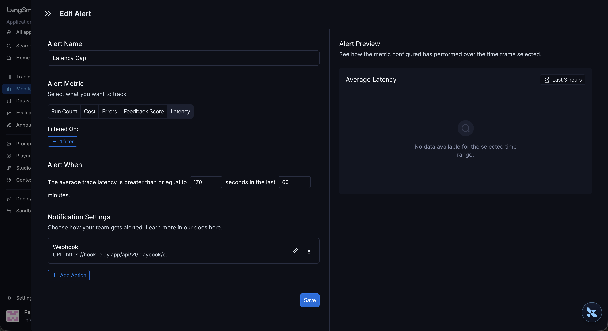
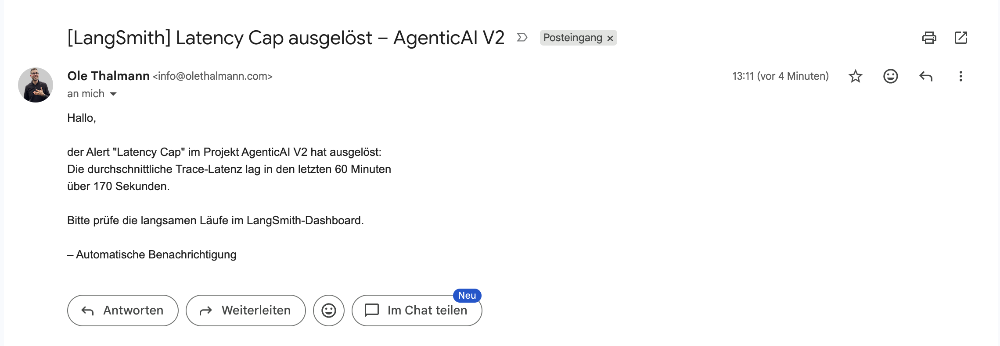
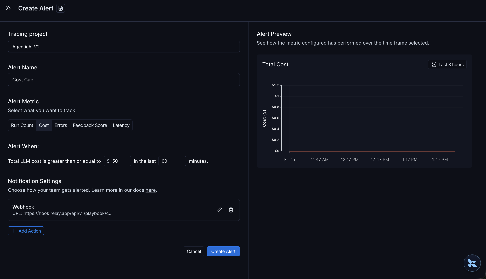
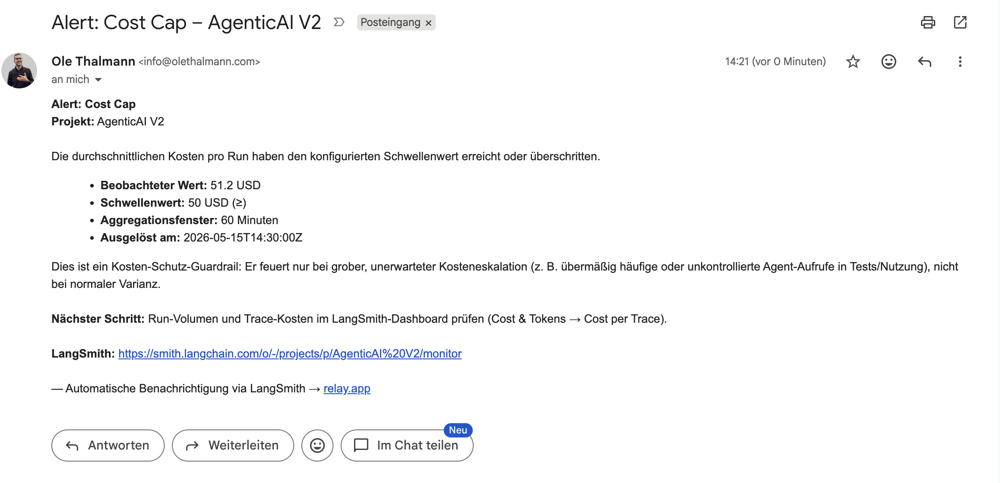
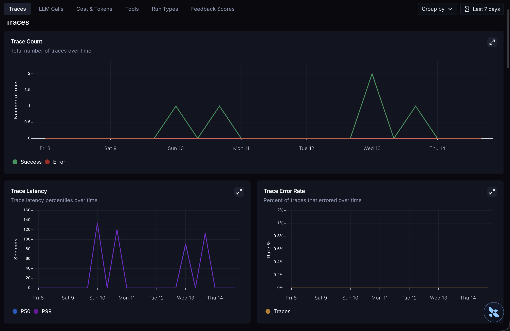
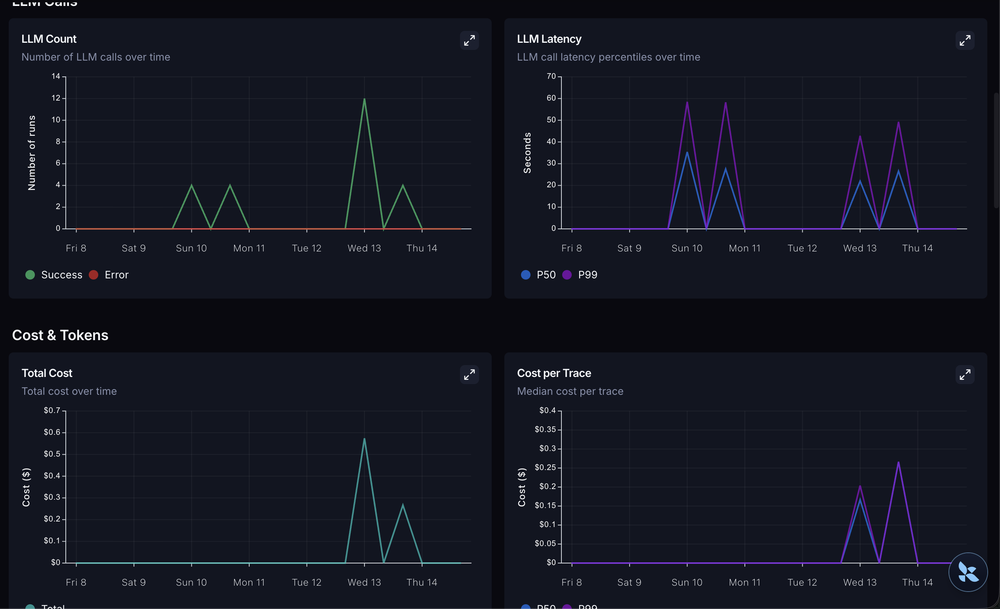
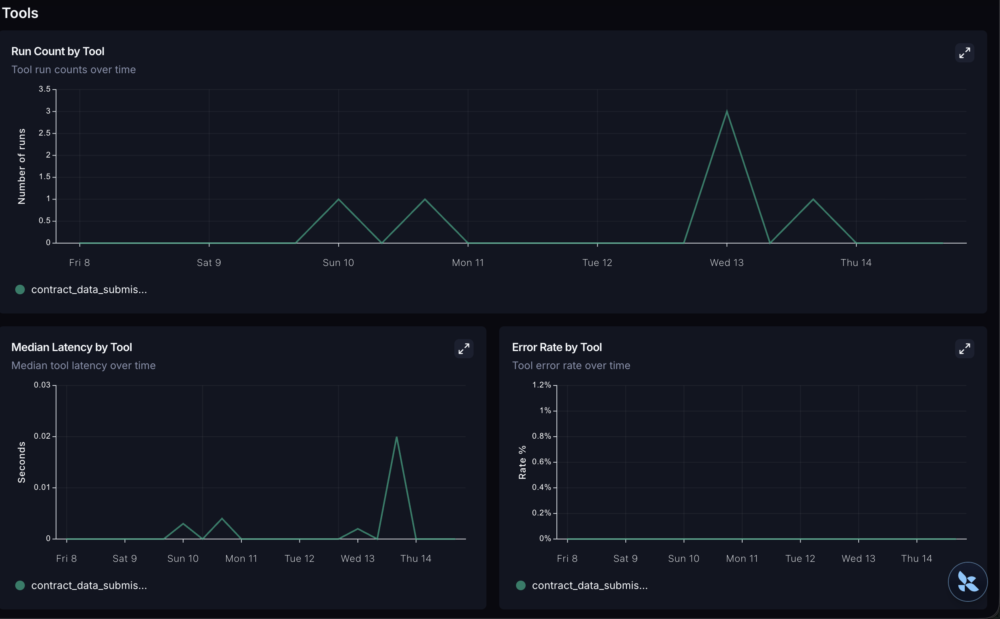
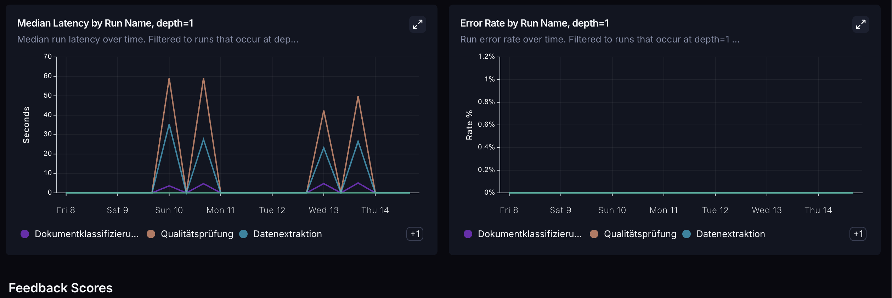

# AgentOps 2 - Evaluation

*Status: 15.05.2026*

## Purpose

This document maps the Evaluation pillar of the watsonx Orchestrate
AgentOps framework (*LU09 - Managing Risk of AI Agents*, Slide 41) onto
the implemented state of the Asklepios document pipeline. It builds on
the Observability pillar (Pillar 1 document) and references its
components where they also serve evaluation. The pillar comprises six
framework cells: OOTB Pre-defined Evals, Self-defined Custom Evals,
Build-time Tools, Runtime Monitoring, Agent Benchmarking, and Data Set
Curation. Each cell with an implemented or configured sub-item is
covered in its own section; every remaining sub-item is enumerated with
its status in section 4.

## Coverage of the Evaluation Cells

| Cell | Sub-item | Status | Section |
|---|---|---|---|
| OOTB Pre-defined Evals | Eval harness, Quality | implemented | 1.1 |
| OOTB Pre-defined Evals | Eval harness, Trajectory | out-of-scope | 4 |
| OOTB Pre-defined Evals | Build-time Red teaming metrics | out-of-scope | 4 |
| OOTB Pre-defined Evals | Guardrails | implemented | 1.1, 1.2, 1.3 |
| OOTB Pre-defined Evals | Build-time messages | out-of-scope | 4 |
| OOTB Pre-defined Evals | Run-Time Evals / Metrics | implemented + configured | 1.4, 1.5 |
| Self-defined Custom Evals | Custom metric for Prompts | out-of-scope | 4 |
| Self-defined Custom Evals | LLM-as-a-Judge | implemented | 2.1 |
| Self-defined Custom Evals | Code-based Custom Metrics | implemented | 2.2 |
| Self-defined Custom Evals | Business Metrics | implemented | 2.3 |
| Self-defined Custom Evals | AI-based grader prompt generation | out-of-scope | 4 |
| Build-time Tools | Experimentation Tracking | out-of-scope | 4 |
| Build-time Tools | Prompt Comparison | out-of-scope | 4 |
| Build-time Tools | Champion/Challenger Comparison | out-of-scope | 4 |
| Runtime Monitoring | Agent metrics dashboard | implemented | 3 |
| Runtime Monitoring | Automated Policy Enforcement | configured | 1.5, 3 |
| Runtime Monitoring | Shadow AI Discovery | out-of-scope | 4 |
| Runtime Monitoring | Agents Dashboard | out-of-scope | 4 |
| Runtime Monitoring | Annotation of production data | out-of-scope | 4 |
| Agent Benchmarking | Evaluating domain agents | out-of-scope | 4 |
| Agent Benchmarking | Agent scanner (X-Ray) | out-of-scope | 4 |
| Agent Benchmarking | Build-time test data generation | out-of-scope | 4 |
| Data Set Curation / Management | Curate test datasets | out-of-scope | 4 |

## 1. OOTB Pre-defined Evals

### 1.1 Code-based Schema Adherence (Quality)

The Extractor returns its result exclusively through the tool
`contract_data_submission`, whose input and output shape is defined by
a Zod schema. Validation is deterministic and model-independent;
violations emit `status: "warning"` or `status: "error"` on the tool
span. This realises the OOTB Eval harness Quality sub-item and the
Code-based Custom Metric of section 2.2 through the same mechanism.

### 1.2 Tool Whitelist (Guardrail)

The Extractor operates against a closed tool registry; calls outside
this set are structurally impossible. The risk class Tool Choice
Hallucination is therefore eliminated by construction rather than
detected after the fact.

### 1.3 Cycle Cap (Guardrail)

The detector `tool_loop_capped` (Pillar 1, section 1.3.2) acts as a
trajectory guardrail: runs exceeding `MAX_TOOL_ROUNDS = 3` tool-call
rounds are force-terminated and tagged. This bounds the action
sequence; it is a guardrail, not a trajectory evaluation. Reference-
based trajectory scoring is out of scope and is stated in section 4.

### 1.4 Run-Time Metrics and Cost per Run

Cost, latency and token consumption are captured per run through
LangSmith tracing (Pillar 1, section 1.2). Cost per Run is directly
readable from the LangSmith dashboard and serves as the business
metric of section 2.3 without an additional definition.

### 1.5 Cost Cap and Latency Cap (Run-Time Policy Enforcement)

Threshold alerts are configured for the project `AgenticAI V2` as a
policy-enforcement layer. They convert the run-time metrics of
section 1.4 into an event-driven notification and thereby cover the
OOTB Run-Time Evals sub-item and the Runtime Monitoring Automated
Policy Enforcement sub-item.

**Configuration**

| Parameter | Latency Cap | Cost Cap |
|---|---|---|
| Metric | average trace latency | average cost |
| Operator | greater than or equal to | greater than or equal to |
| Threshold | 170 seconds | 50 USD |
| Aggregation window | 60 minutes | 60 minutes |
| Scope filter | project `AgenticAI V2` | project `AgenticAI V2` |
| Notification | webhook to relay.app | webhook to relay.app |

The two thresholds follow deliberately different design intents.

The Latency Cap is set to 1.5x the latency of the most recent
production reference trace (baseline 112.66 s; trace of 14.05.2026,
09:44). The 1.5 factor tolerates normal variance and fires only on
pronounced outliers. As that reference trace was itself a failure
case (tags `tool_loop_capped`, `tool_schema_fail`), the threshold is
deliberately conservative; recalibration against a clean reference run
is foreseen.

The Cost Cap is intentionally not derived from a reference trace. It
is a flat circuit-breaker at 50 USD average cost per run. A single
extraction run costs cents (baseline 0.2665 USD), so the ceiling is
orders of magnitude above normal operation and is never reached in
correct use. Its sole purpose is to guarantee that future tests or
usage cannot drive the agent into excessively frequent or runaway
invocation and thereby generate unbounded cost. It is a cost-safety
guardrail, not an outlier-sensitivity metric: it accepts wide normal
variance and fires only on a gross, unaccounted cost escalation.

**Architecture and data flow**

The LangSmith alert engine evaluates the metric per aggregation
window and invokes a webhook when the threshold is reached. LangSmith
alert actions support only `webhook`, `pagerduty` and `dynatrace`;
there is no native email delivery, so notification is delivered
through a relay.app workflow:

    LangSmith (alert)  --webhook-->  relay.app (workflow)  -->  email

The relay.app workflow is an inbound webhook trigger plus an email
action to the operator; the delivery chain is testable end-to-end
independently of an actual threshold breach.

**Implementation note**

The LangSmith platform alert API is in alpha and proved unreliable
for programmatic creation (HTTP 200 without persistence, undocumented
required fields). Both alert rules were therefore created through the
LangSmith UI (Monitoring, Alerts). Figure 1 shows the Latency Cap
configuration and Figure 3 the Cost Cap configuration. For each, the
delivery chain was verified end-to-end via a manual webhook
invocation; Figures 2 and 4 show the delivered notifications.

*Figure 1. LangSmith alert configuration "Latency Cap".*

*Figure 2. Latency Cap alert notification delivered via relay.app.*

*Figure 3. LangSmith alert configuration "Cost Cap": project
`AgenticAI V2`, metric Cost, total LLM cost greater than or equal to
50 USD over a 60-minute window, same relay.app webhook action as the
Latency Cap.*

*Figure 4. Cost Cap alert notification delivered via relay.app;
end-to-end verification, observed value 51.2 USD against the 50 USD
threshold.*

**Status**

Both caps are configured and verified end-to-end. At the current run
volume (single digits) the windowed average has limited statistical
significance; the mechanism is nonetheless fully established and
scales without further change as volume grows.

## 2. Self-defined Custom Evals

### 2.1 Built-in LLM-as-a-Judge

The Control agent in `packages/core/src/agent/asklepios-control.ts`
operates as a downstream judge on the tool-validated extraction. It
receives the original contract together with the extraction and
assigns a per-field `confidence_score` in `[0.0, 1.0]` with a textual
justification and a source quote. Field-level scores aggregate into an
`overall_confidence`. Escalation is binary: `overall_confidence >= 0.8`
sets `overall_status: "ok"`, otherwise `review_required`. This
threshold implements the separation between Human-Out-of-the-Loop and
Human-on-the-Loop. The judge runs on the production path; a separate
offline evaluator pipeline is therefore not required.

### 2.2 Code-based Custom Metrics

Realised by the deterministic Zod validation of section 1.1: schema
adherence and field-type correctness are evaluated without a model
call and are therefore stable and reproducible.

### 2.3 Business Metric: Cost per Run

Cost per Run is read directly from the LangSmith dashboard, from the
"Cost per Trace" panel of the Cost and Tokens tab (section 1.4;
Figure 6). It serves as the business metric without an additional
definition or pipeline.

## 3. Runtime Monitoring

Runtime monitoring is provided by the LangSmith UI (agent metrics
dashboard, run and trace views) together with the policy-enforcement
alerts of section 1.5. The alert chain (LangSmith threshold to webhook
to relay.app to email) is established and verified independently of an
actual breach.

The agent metrics dashboard aggregates the run-time metrics of
section 1.4 over a selectable window. It is organised in tabs;
Figures 5 to 8 show the four substantive tabs for `AgenticAI V2`.

*Figure 5. Traces tab: trace count, trace latency percentiles (P50,
P99) and trace error rate over time.*

*Figure 6. LLM Calls and Cost and Tokens tabs: LLM call count, LLM
latency percentiles, total cost and median cost per trace over time.
The "Cost per Trace" panel is the direct source of the Cost per Run
business metric (sections 1.4 and 2.3).*

*Figure 7. Tools tab: run count, median latency and error rate per
tool over time (here `contract_data_submission`).*

*Figure 8. Run Types tab: median latency and error rate per run name
at depth 1 (Dokumentklassifizierung, Qualitaetspruefung,
Datenextraktion), plus the Feedback Scores section.*

## 4. Out of Scope

The following sub-items are deliberately not implemented in the
current prototype phase. The shared reason is the absence of a
curated reference dataset: at present such a dataset would be either
purely synthetic, and therefore only partly representative of real
Swiss employment contracts, or would require significant curation
effort on production traces without a corresponding return on
investment at prototype scale (single-digit run volume).

- **Eval harness, Trajectory.** Reference-based trajectory scoring
  requires a labelled expected-trajectory dataset that does not exist.
  The bounded-action guardrail (section 1.3) covers the safety-
  relevant aspect; full trajectory evaluation is recoverable once a
  curated set exists.
- **Build-time Red teaming metrics** and **Build-time messages.** No
  build-time adversarial or scripted-message harness is run; risk is
  instead reduced by construction (tool whitelist, schema validation,
  cycle cap).
- **Custom metric for Prompts** and **AI-based grader prompt
  generation.** The judge prompt (section 2.1) is hand-authored and
  versioned with the code; no automatic grader-prompt generation or
  separate prompt-quality metric is maintained.
- **Build-time Tools** (Experimentation Tracking, Prompt Comparison,
  Champion/Challenger Comparison). These depend on a stable reference
  dataset for comparative scoring.
- **Shadow AI Discovery**, **Agents Dashboard**, **Annotation of
  production data.** The system is a single, owned pipeline, not a
  multi-agent fleet; there is no shadow estate to discover and no
  agent catalogue to surface. Production-data annotation is the
  dataset-curation prerequisite that is itself out of scope.
- **Agent Benchmarking** (Evaluating domain agents, Agent scanner
  / X-Ray, Build-time test data generation) and **Data Set Curation /
  Management.** All depend on a curated benchmark or test dataset.

These items are recoverable in a later maturity step once a curated
evaluation set exists.

## Reference to the Framework Table

This document covers the Evaluation row of the watsonx Orchestrate
AgentOps framework (*LU09 - Managing Risk of AI Agents*, Slide 41):
the cells OOTB Pre-defined Evals, Self-defined Custom Evals, Build-time
Tools, Runtime Monitoring, Agent Benchmarking, and Data Set Curation,
to the extent implemented or configured in the current project state.
